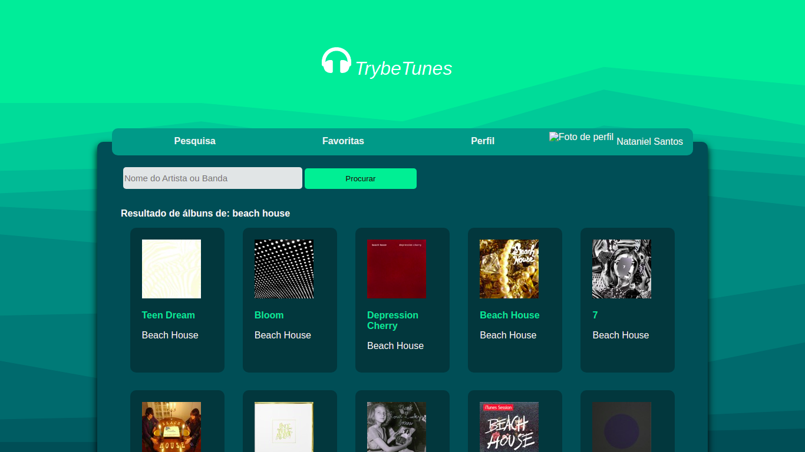

<h1 align="center">
    
  <i>TrybeTunes</i>
</h1>

    

## 💻 Projeto

Terceiro projeto do módulo de Front-End desenvolvido no Curso de Desenvolvimento Web da Trybe. O objetivo era desenvolver uma aplicação web para salvar as músicas favoritas. A aplicação foi feita usando React e utilizando a API do iTunes pra obter as informações das músicas. O fundo da pagina foi feito o site haikei.app. O grande diferencial do meu projeto foi salvar foto de perfil no LocalStorage do usuário codificando a imagem em base64.

Link da aplicação: https://natanielsantos159.github.io/trybetunes

    

